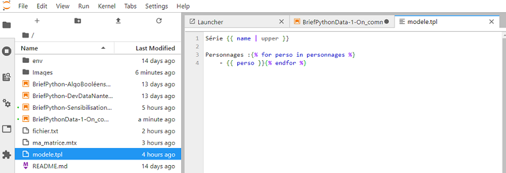

image::https://img.shields.io/badge/License-Apache%202.0-blue.svg[link="http://www.apache.org/licenses/LICENSE-2.0"]

image:https://img.shields.io/badge/License-Apache%202.0-blue.svg[link="http://www.apache.org/licenses/LICENSE-2.0"]

image::https://upload.wikimedia.org/wikipedia/commons/3/35/Tux.svg[Tux,350,350]

You can find image:https://upload.wikimedia.org/wikipedia/commons/3/35/Tux.svg[Linux,35,35] everywhere these days.

